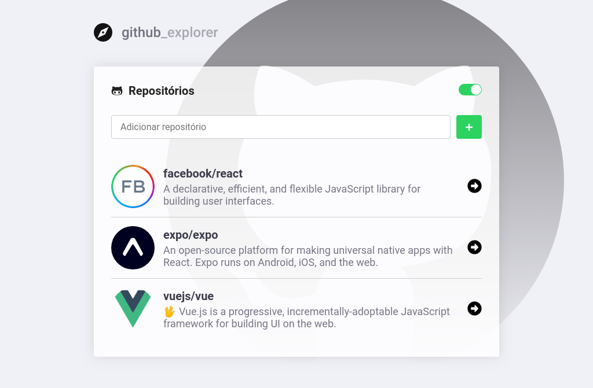
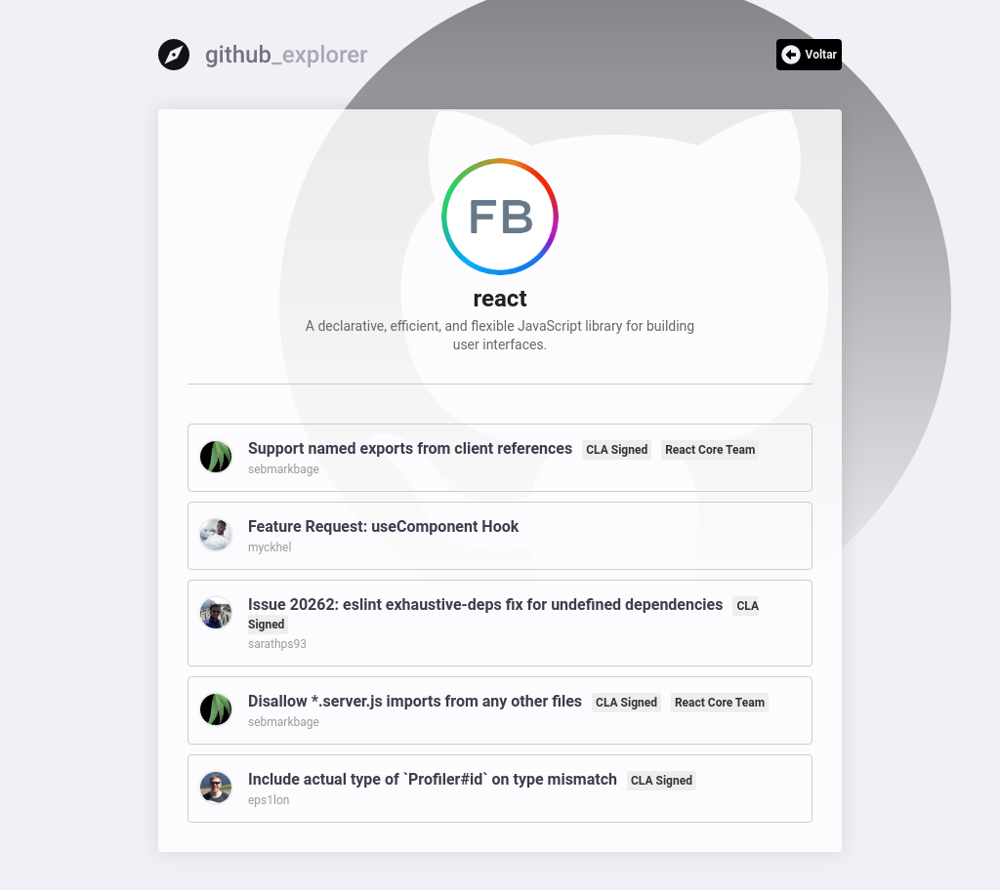
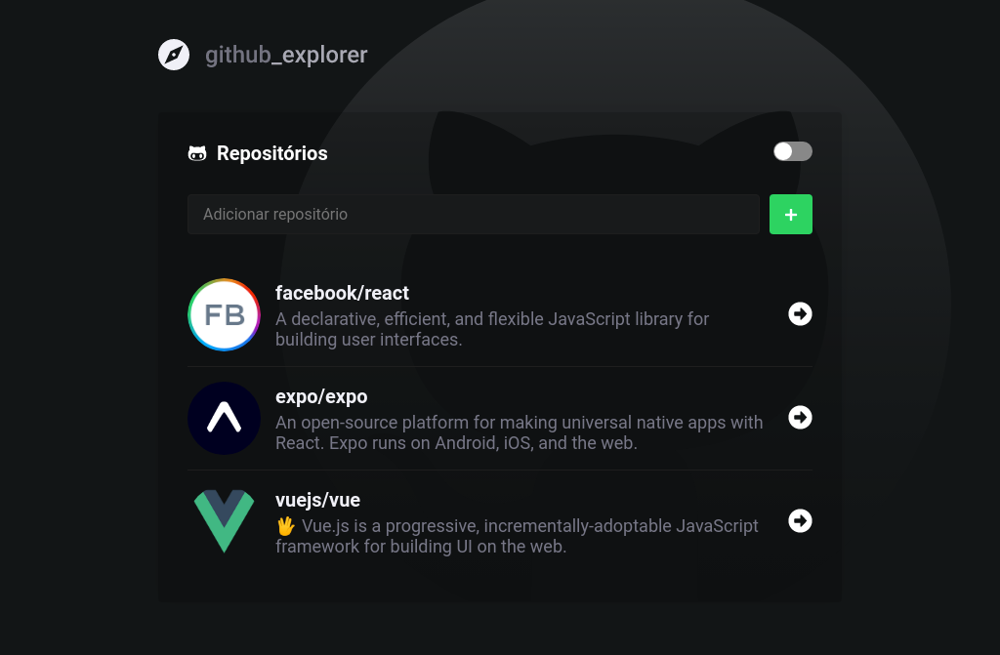

<p align=center>
  
</p>

<h3 align="center">
  <a href="#-sobre">Sobre</a>&nbsp;|&nbsp;
  <a href="#-tecnologias-utilizadas">Tecnologias</a>&nbsp;|&nbsp;
  <a href="#-imagens-do-sistema">Imagens do sistema</a>&nbsp;|&nbsp;
  <a href="#-como-usar">Como usar</a>&nbsp;|&nbsp; 
</h3>

## 🗒 Sobre

O **Github_explorer** é uma aplicação que foi desenvolvida visando permitir que um usuário busque por repositórios e suas issues com uma interface mais amigável, com a aplicação é possível buscar por repositórios e navegar pelas issues mais recentes.

## 🚀 Tecnologias Utilizadas

  * [ReactJS](https://pt-br.reactjs.org)
  * [Styled Components](https://styled-components.com/)
  * [Axios](https://github.com/axios/axios)
  * JavaScript
  * API - Github
  
## 🖼 Imagens do sistema

**Tema light**


**Tema dark**



## 📦 Como usar

```bash

  #Clonar o repositório
  $ git clone https://github.com/JonathanKBP/github_explorer.git

  # Instalar as dependências
  $ yarn 

  # Inciar o projeto
  $ yarn start

```

Desenvolvido por 💻  Jonathan Kevin
